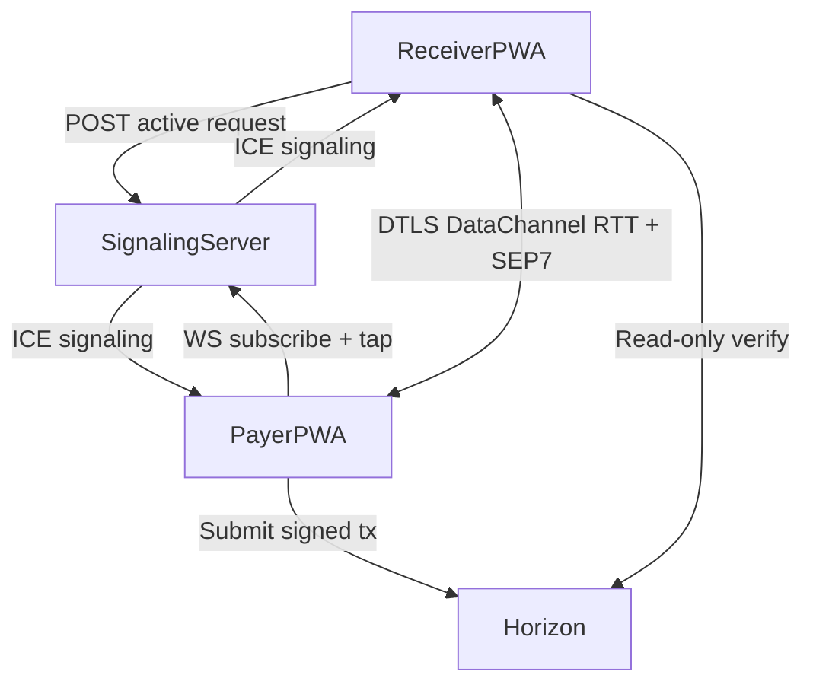

# Architecture (MVP → tap UX)

## Component responsibilities (CMF-safe model)

### Wallet (payer)

- Generates/imports a Stellar account (self-custodial).
- Receives a payment request (**WebRTC DataChannel** in target UX; **QR / paste** today and as fallback).
- Builds the Stellar transaction locally.
- Signs locally.
- Submits directly to Horizon.
- Displays tx hash and confirmation status.

### Merchant / receiver request tool

- Stores/inputs receiving address (and **username** for discovery when signaling exists).
- Creates payment requests (SEP-7 + request envelope).
- Registers active request with **signaling server** (TTL); shows **waiting for tap** state.
- **Target:** full URI crosses WebRTC after proximity gate; **today:** QR / payload text.
- Reads Horizon to verify whether a matching transaction exists.
- Displays “transaction detected on Stellar” (no guarantee wording).

### Signaling server (next milestone)

- HTTPS + WebSocket (e.g. **Socket.io**).
- Stores **active_requests** (username, `requestId`, expiry)—**not** user keys; avoid persisting full SEP-7 if design allows.
- Relays **WebRTC signaling** (offer, answer, ICE candidates) between payer and receiver for a given `requestId`.
- Rate limits; short TTL (e.g. 90s).

### Relayer (optional, later)

- Subscribes to Horizon events.
- Sends push notifications.
- Never constructs, signs, or submits transactions.
- Never holds user keys.
- Orthogonal to WebRTC; can complement “tx confirmed” when app is backgrounded.

## Minimal data exchanged peer-to-peer

After ICE, the **payment request** (typically **SEP-0007 URI** or envelope bytes) crosses the **DataChannel** only after the **RTT proximity gate** passes. Optional: **tx hash** returns on the same channel for instant UI on the receiver.

No private keys or raw signing material transits the signaling server.

## Verification model (receiver side)

Receiver verifies a match by checking Horizon for:

- destination == merchant address
- amount/asset match the request
- memo contains request binding (e.g. `st:` + nonce prefix, aligned with wallet)
- transaction successful on-chain

## Diagram (target tap flow)

## Diagram (current baseline — QR / paste)

