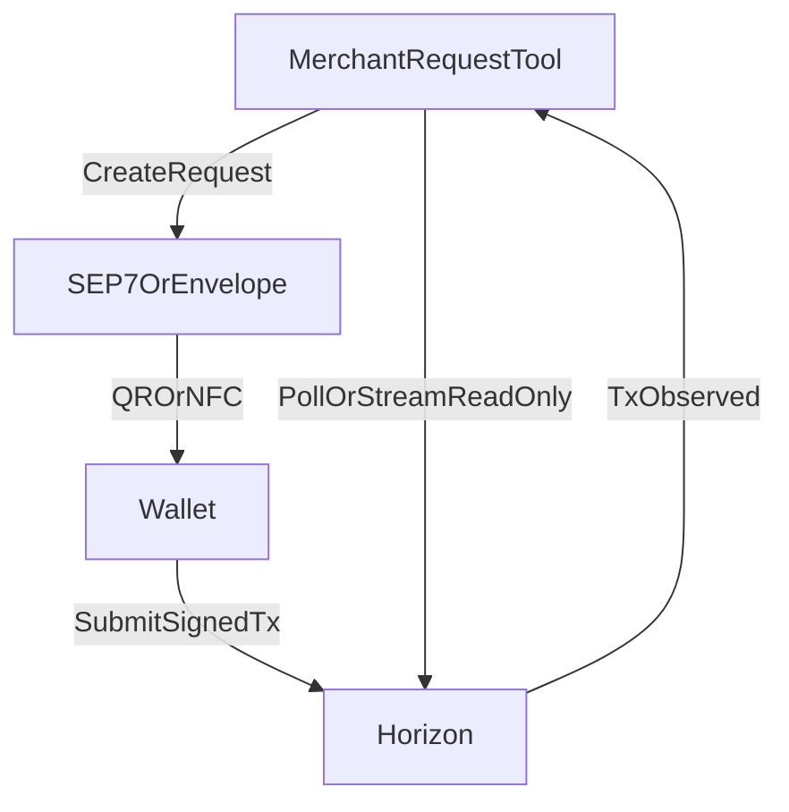

# Architecture (MVP)

## Component responsibilities (CMF-safe model)

### Wallet (payer)

- Generates/imports a Stellar account (self-custodial).
- Receives a payment request (QR/NFC/BLE).
- Builds the Stellar transaction locally.
- Signs locally.
- Submits directly to Horizon.
- Displays tx hash and confirmation status.

### Merchant request tool (payee)

- Stores/inputs receiving address.
- Creates payment requests (SEP-7 + request envelope).
- Displays the request (QR baseline; NFC/BLE optional).
- Reads Horizon to verify whether a matching transaction exists.
- Displays “transaction detected on Stellar” (no guarantee wording).

### Relayer (optional, later)

- Subscribes to Horizon events.
- Sends push notifications.
- Never constructs, signs, or submits transactions.
- Never holds user keys.

## Minimal data exchanged between phones

The only mandatory payload is a **payment request** describing:

- destination address
- amount + asset
- nonce/timestamp/expiry hints

No private keys, no signatures, no transaction XDR need to be transported between phones in the CMF-safe MVP model.

## Verification model (merchant side)

Merchant tool verifies a match by checking:

- destination == merchant address
- amount/asset match the request
- memo contains a request nonce (recommended)
- transaction is successful and confirmed on-chain

## Diagram

