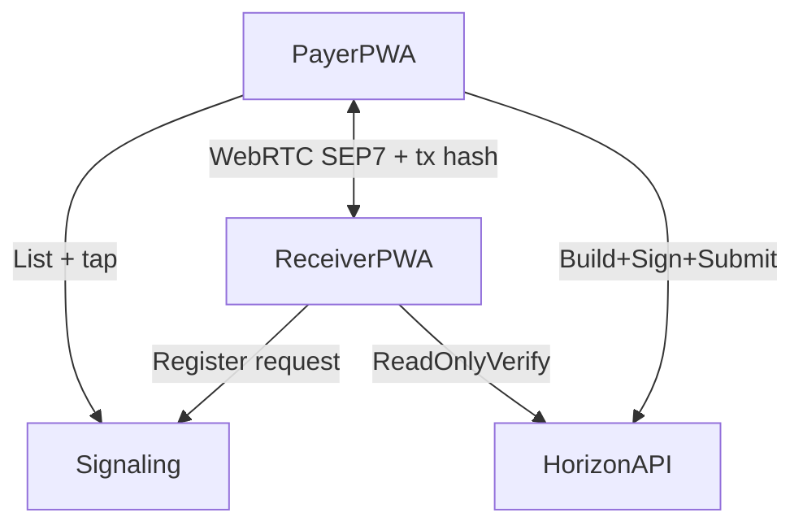

# End-to-End Flow (E2E)

This describes the **target tap flow** and the **current MVP** (QR/paste).

## Actors

- **Payer**: sends funds.
- **Payee/Receiver**: receives funds (merchant tool or wallet in “receive” mode).
- **Signaling server** (next milestone): matchmaking + WebRTC signaling only.
- **Stellar network / Horizon**: settlement and verification.

## Step 1 — Wallet setup (both sides)

1. Payer opens the StellarTap wallet (PWA).
2. Wallet creates or imports a Stellar account.
3. Private key stays on device (encrypted at rest).

Receiver configures receiving address and **username** (for discovery when signaling exists).

## Step 2 — Receiver creates a request

1. Receiver opens the request / merchant UI.
2. Enters amount + asset (MVP: XLM) and optional memo.
3. Tool builds **SEP-7 / envelope**.
4. **Target UX:** POST **active request** to signaling server → **“Waiting for tap…”**.
5. **Current MVP:** Display **QR** or copyable payload (same request bytes/URI).

## Step 3 — Payer gets the request

### Target (happy path): Pay nearby + tap

1. Payer opens **Pay nearby**; WebSocket shows **live request cards**.
2. Payer **taps** the right card → ICE signaling via WebSocket → **DataChannel** opens.
3. **Proximity gate:** ping/pong RTT must fall under threshold.
4. **Full SEP-7 URI** arrives on the channel → wallet parses (same as today).

### Fallback: QR or paste

1. Payer scans QR or pastes URI / `stellartap:v1:…` payload.
2. Wallet parses as today.

## Step 4 — Payer confirmation

Product decision: after tap + proximity, wallet may show a **single** confirmation or proceed per spec. MVP web wallet today shows explicit **Confirm & send**.

## Step 5 — Wallet constructs, signs, submits

1. Wallet builds Stellar payment locally.
2. Signs with payer key.
3. Submits to Horizon.

**Target:** optional **tx hash** sent back over DataChannel for instant receiver UI.

## Step 6 — Both sides see outcome

- Wallet shows sent + tx hash.
- Receiver sees match via Horizon (and optional in-channel hash).

## Optional — Push (later)

Minimal relayer: Horizon stream → push. **Does not** submit transactions.

## Architecture snapshot (target)

