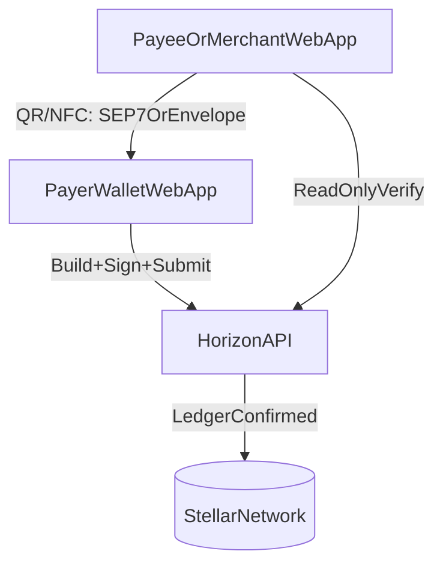

# End-to-End Flow (E2E)

This describes the MVP flow without implementation details.

## Actors

- **Payer**: the person who will send funds.
- **Payee/Merchant**: the person who will receive funds.
- **Stellar network**: settlement layer.
- **Horizon**: public API gateway to submit and read transactions.

## Step 1 — Wallet setup (both sides)

1. Payer opens the StellarTap wallet (web/PWA in MVP).
2. Wallet creates or imports a Stellar account.
3. Private key is stored locally (encrypted at rest); it never leaves the device.

Payee does the same (or uses an existing receiving address).

## Step 2 — Payee requests payment

1. Payee opens the merchant request tool (web/PWA in MVP).
2. Enters amount + asset (MVP: XLM).
3. Tool produces a **payment request** (SEP-7 link and/or request envelope).
4. Tool displays the request as a **QR code** (baseline transport).
5. (Optional) tool broadcasts the same request via NFC/BLE where available.

## Step 3 — Payer receives request (tap or scan)

Option A (universal): **scan QR**

1. Payer scans the QR code.
2. Wallet parses the embedded request (SEP-7 / envelope).

Option B (where supported): **tap NFC**

1. Phones exchange the request payload over NFC.
2. Wallet parses the same request.

## Step 4 — Payer confirms

Wallet shows a confirmation screen:

- destination (payee address)
- amount/asset
- expiry (if provided)

Payer approves (biometric/PIN when available).

## Step 5 — Wallet constructs, signs, submits

1. Wallet builds a Stellar payment transaction locally.
2. Wallet signs using the payer’s private key.
3. Wallet submits the signed transaction directly to Horizon.

## Step 6 — Both sides verify on-chain

- Wallet shows “sent” with tx hash.
- Payee/merchant tool shows “transaction detected on Stellar” once the transaction is observed on-chain.

## Optional — Push confirmation (later milestone)

A minimal relayer service can subscribe to Horizon and send push notifications after a matching transaction is confirmed. This service does **not** submit transactions.

## Architecture snapshot

